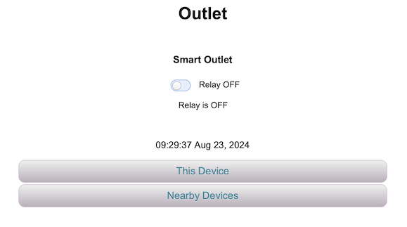
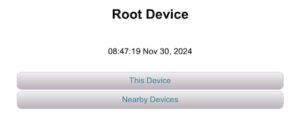
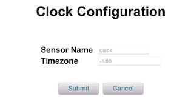
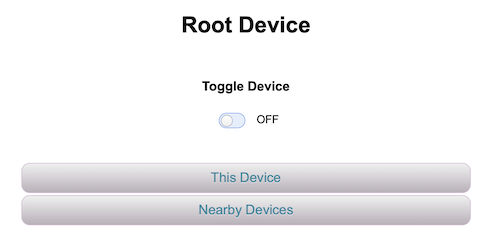

# DeviceLib
DeviceLib is a library of turn-key [UPnPDevices](https://github.com/dltoth/UPnPLib) for ESP8266 and ESP32, based on the [UPnP 1.1 Device Architecture](http://upnp.org/specs/arch/UPnP-arch-DeviceArchitecture-v1.1.pdf). Use of this library requires the companion libraries [CommonUtil](https://github.com/dltoth/CommonUtil) for user interface, [UPnPLib](https://github.com/dltoth/UPnPLib) for device architecture and service discovery, [SystemClock](https://github.com/dltoth/SystemClock) for NTP synchronized time, and [WiFiPortal](https://github.com/dltoth/WiFiPortal) for access point configuration. 

DeviceLib includes the following classes:

```
   ExtendedDevice         := An extended RootDevice that includes ssdp search to find nearby devices and configuration that includes access point reset
   HubDevice              := An ExtendedDevice that displays all RootDevices on a local network. With HubDevice, only one mDNS name is necessary, all 
                             other devices can be accessed via the HubDevice portal interface
   Sensor                 := A configurable UPnPDevice base class providing Sensor reading as simple HTML and Sensor configuration through ConfigurationServices
   SoftwareClock          := A Sensor that synchronizes system time with an NTP server and provides date and time
   Thermometer            := A DHT22 Temperature/Humidity Sensor. Thermometer requires the additional library DHT_sensor_library_for_ESPx
   Hydrometer             := A Sensor that reads from the analog pin and computes soil moisture content
   Control                := A configurable UPnPDevice base class providing its Control UI thru an iFrame and configuration through ConfigurationServices
   RelayControl           := A Control for managing a relay with two states ON and OFF
   SensorControlledRelay  := A virtual subclass of RelayControl that allows control of a Relay with a Sensor
   HumidityFan            := A SensorControlledRelay that couples a Thermometer with a RelayControl, with ON/OFF determined by relative humidity
   OutletTimer            := A SensorControlledRelay that couples a SoftwareClock with a RelayControl with ON/OFF determined by time intervals
   ControlServices        := UPnPServices for managing ControlState (ON/OFF) and ControlMode (AUTOMATIC/MANUAL)
   ConfigurationServices  := UPnPServices for managing configuration (GetConfiguration/SetConfiguration)
```

The library is centered around the two base classes [Sensor](https://github.com/dltoth/DeviceLib/blob/main/src/SensorDevice.h), a configurable UPnPDevice with simple HTML display, and [Control](https://github.com/dltoth/DeviceLib/blob/main/src/Control.h), a configurable UPnPDevice with complex HTML display. It also includes a turn-key Device Hub, [HubDevice](https://github.com/dltoth/DeviceLib/blob/main/src/HubDevice.h), that can be included in a boilerplate sketch to provide access to all UPnP [RootDevices](https://github.com/dltoth/UPnPLib/blob/main/src/UPnPDevice.h) on a local network.

It is assumed the reader is familiar with UPnPDevice development as described in the [documentation for UPnPLib](https://github.com/dltoth/UPnPLib).

## Basic Usage

To see how this works, consider a [simple sketch](https://github.com/dltoth/DeviceLib/blob/main/examples/RelayControl/RelayControl.ino) consisting of an [ExtendedDevice](https://github.com/dltoth/DeviceLib/blob/main/src/ExtendedDevice.h) with a Control ([RelayControl](https://github.com/dltoth/DeviceLib/blob/main/src/RelayControl.h)), and Sensor ([SoftwareClock](https://github.com/dltoth/DeviceLib/blob/main/src/SoftwareClock.h)). First notice devices are instantiated in global scope above the <i>setup()</i> routine as follows:

```
SSDP             ssdp;
ExtendedDevice   root;
SoftwareClock    c;
RelayControl     relay;
const char*      deviceName = "Outlet";
```

*SSDP* is used for Service discovery, *ExtendedDevice* is a *RootDevice* container with configuration and search, *SoftwareClock* and *RelayControl* are embedded devices. 

Next review device configuration:

```
/**
 *  Set timezone to Eastern Daylight Time
 */
  c.setTimezone(-5.0);

/**
 *  Set client display name to something recognizable from "Nearby Devices".
 */
  root.setDisplayName(deviceName);
  relay.setDisplayName("Smart Outlet");

/**
 *  root.setup() will register HTTP handlers based on target, so setTarget() must always be called prior to setup(), 
 *  otherwise a default target will be used.
 */
  root.setTarget("device");
  relay.setTarget("relay");
```

Timezone on the *SoftwareClock* is set to EST (-5.0), display name for ``root`` is set to "Outlet" and ``relay`` is set to "Smart Outlet", and target URLs are set to <b><i>device</i></b> and <b><i>relay</i></b> respectively.

```
/**
 *  Register HTTP handlers based on device target and setup any embedded devices or services added at this point
 */
  root.setup(&ctx);

/**
 *  Initialize SSDP services
 */
  ssdp.begin(&root);

/**
 *  Late binding for embedded devices; setup will be called for each device as  
 *  they are added. Alternavively, embedded devices can be added prior to RootDevice 
 *  setup. In either case, devices are displayed in the order that they are added.
 *  Note that device target must be set prior to calling setup or adding to the 
 *  RootDevice.
 *  Device pin definitions must be set prior to the call to setup.
 */
  root.addDevices(&relay,&c);

  UPnPDevice::printInfo(&root);
```

Next, HTTP request handlers are set on ``root`` with ``root.setup(&ctx)``, *SSDP* is started on ``root``, and the *RelayControl* and *SoftwareClock* are added to the ``root`` with ``root.addDevices(&relay,&c);``. The last line ``UPnPDevice::printInfo(&root);`` will print the UPnP device hierarchy to the Serial monitor.


Lastly, see the ``loop()`` function:

```

/**
 *  Do a unit of work for the device
 */
  root.doDevice();

/**
 *  Handle SSDP queries
 */
  ssdp.doSSDP();

/**
 *  Handle HTTP requests
 */
  ctx.handleClient();

```

The call ``root.doDevice()`` handles any workload intented for the *RootDevice* and all of its embedded devices, ``ssdp.doSSDP()`` handles all request/response for SSDP queries, and ``ctx.handleClient()`` is proxy for the WebServer *handleClient()* method.

Now, flash an ESP device with the sketch above, start it up and point a browser to the device IP address. 

*Figure 1 - RootDevice display at http\://device-IP:80*



As discussed, device display is in the order that devices were added to the <i>RootDevice</i> with <i>RelayControl</i> at the top of the page and <i>SoftwareClock</i> below that. <i>RelayControl</i> consists of a toggle and text and is displayed in an iFrame, and <i>SoftwareClock</i> displays date/time in a single line of HTML.

Selecting the <b><i>This Device</b></i> button displays all of the <i>RootDevice</i> embedded devices as selectable buttons in the order they were added, the same as the page displayed at *http\//device-IP:80/device*.

*Figure 2 - RootDevice display at http\://device-IP:80/device*


So a <i>RootDevice</i> displays its embedded devices at *http\://device-IP:80/root-target*, as a list of buttons, one for each embedded device in the order they were added, along with a <i>Configure</i> button. In this example there are buttons for ``RelayControl`` and ``SoftwareClock``, each labeled with their display name. Selecting either will bring up the display for the specific device, and selecting <i>Configure</i> will bring up the <i>RootDevice</i> configuration page. Embedded devices are displayed at *http\://device-IP:80/root-target/device-target*.

Now, select the <b><i>Software Clock</i></b> button.

*Figure 3 - RootDevice display at http\://device-IP:80/device/clock*


**Important Note:** The default target for <i>SoftwareClock</i> is <b><i>clock</b></i> (defined in its constructor), so if multiple SoftwareClocks are required in a device, each MUST be given a unique target using: 

```
  SoftwareClock::setTarget(const char*)
```

Also, note the difference between <i>SoftwareClock</i> display at *http\://device-IP:80*, where display consists of a single line of HTML, and <i>SoftwareClock</i> display at *http\://device-IP:80/device/clock* where display consists of multiple lines of HTML. That difference is driven by implementation of the ``formatContent(...)`` and ``formatRootContent(...)`` methods as discussed in [Custom Sensors and Controls](#custom-sensors-and-controls) below.

Lastly, notice the Serial monitor output:

```
RootDevice Outlet:
   UUID: b7d7a4db-5c83-4b5c-b89f-7fc56fdeb9b5
   Type: urn:LeelanauSoftware-com:device:ExtendedDevice:1.0.0
   Location is http://192.168.1.30:80
   Outlet Services:
      Get Configuration:
         Type: urn:LeelanauSoftware-com:service:getConfiguration:1.0.0
         Location is http://192.168.1.30:80/device/getConfiguration
      Set Configuration:
         Type: urn:LeelanauSoftware-com:service:setConfiguration:1.0.0
         Location is http://192.168.1.30:80/device/setConfiguration
Outlet Devices:
Smart Outlet:
   UUID: 22b6aabb-17a3-45c7-9b2d-6140676bf1a9
   Type: urn:LeelanauSoftware-com:device:RelayControl:1.0.0
   Location is http://192.168.1.30:80/device/relay
   Smart Outlet Services:
      Get Configuration:
         Type: urn:LeelanauSoftware-com:service:getConfiguration:1.0.0
         Location is http://192.168.1.30:80/device/relay/getConfiguration
      Set Configuration:
         Type: urn:LeelanauSoftware-com:service:setConfiguration:1.0.0
         Location is http://192.168.1.30:80/device/relay/setConfiguration
      Set State:
         Type: urn:LeelanauSoftware-com:service:setState:1.0.0
         Location is http://192.168.1.30:80/device/relay/setState
Software Clock:
   UUID: adc739a7-75b6-419a-98fe-466c3e6b14a9
   Type: urn:LeelanauSoftware-com:device:SoftwareClock:2.1.1
   Location is http://192.168.1.30:80/device/clock
   Software Clock Services:
      Get Configuration:
         Type: urn:LeelanauSoftware-com:service:getConfiguration:1.0.0
         Location is http://192.168.1.30:80/device/clock/getConfiguration
      Set Configuration:
         Type: urn:LeelanauSoftware-com:service:setConfiguration:1.0.0
         Location is http://192.168.1.30:80/device/clock/setConfiguration
      Get Date/Time:
         Type: urn:LeelanauSoftware-com:service:getDateTime:1.0.0
         Location is http://192.168.1.30:80/device/clock/getDateTime
```

*RootDevice* and embedded device locations are as discussed above. Also, *ExtendedDevice* has standard *GetConfiguration* and *SetConfiguration* services, as do *Sensor* and *Control*. In addition, *RelayControl* has a *SetState* service, and *SoftwareClock* has a *GetDateTime* service. [Customizing configuration](#adding-custom-configuration) is discussed further below.

<a name="custom-sensors-and-controls"></a>

## Custom Sensors and Controls ##

A <i>Sensor</i> is a simple device that provides a reading, like temperature or moisture content, and supplies its display in minimal HTML, ideally a single line, where a Control is intended to have more extensive HTML content provided by a separate URL embedded in an iFrame. Embedded devices insert their HTML into a fixed length display buffer at the root location governed by the method

```
    int    formatRootContent(char buffer[], int size, int pos);
```

A *Sensor* will insert its HTML directly into ``buffer``, where *Control* will insert an iFrame container and rely on the implementation of 

```
    int    formatContent(char buffer[], int size, int pos);
```

for final display. A *UPnPDevice* that expects extensive HTML at the root location should derive from [Control](https://github.com/dltoth/DeviceLib/blob/main/src/Control.h) and a device with simple HTML at the root location shoud derive from [Sensor](https://github.com/dltoth/DeviceLib/blob/main/src/SensorDevice.h). Keep in mind that a *Sensor* can have a more extensive HTML display at the device location governed by its ``formatContent(...)`` method, but at the root location it is expected to be lean.

### Customizing the *Sensor* Class

To start, consider a custom *Sensor* [ClockDevice](https://github.com/dltoth/DeviceLib/blob/main/examples/CustomSensor/ClockDevice.h) implementing display for a [SystemClock](https://github.com/dltoth/SystemClock).

```
#include <SystemClock.h>
#include <DeviceLib.h>

/**
 *   Custom Sensor implementing a SystemClock
**/
class ClockDevice : public Sensor {

    public:
      ClockDevice() : Sensor("clock")                   {setDisplayName("Clock");}
      ClockDevice( const char* target) : Sensor(target) {setDisplayName("Clock");}

      Instant       now()                  {return _clock.now();}
      void          setTimezone(double tz) {_clock.tzOffset(tz);}
      double        getTimezone()          {return _clock.tzOffset();}
      
/**
 *   Virtual Functions required for UPnPDevice
 */
      void           setup(WebContext* svr);

/**
 *   Virtual Functions required by UPnPDevice
 */
      int           formatContent(char buffer[], int size, int pos);
      int           formatRootContent(char buffer[], int size, int pos);

/**
 *   Macros to define the following Runtime Type Info:
 */
      DEFINE_RTTI;
      DERIVED_TYPE_CHECK(Sensor);
    
    protected:

      SystemClock       _clock;

/**
 *   Copy construction and destruction are not allowed
 */
      DEFINE_EXCLUSIONS(ClockDevice);         

};
```

*ClockDevice* derives from *Sensor* and has a *SystemClock* member `_clock`. It has member methods to get and set timezone and get the current time. Notice

```
      DERIVED_TYPE_CHECK(Sensor);
```

informs RTTI that *ClockDevice* derives from *Sensor*. Also notice that for simplicity, timezone input is raw double precision without error checking. 

Implementation for *ClockDevice* requires extending the virtual methods

```
      int           formatContent(char buffer[], int size, int pos);
      int           formatRootContent(char buffer[], int size, int pos);
```

for device display, and the method

```
      void           setup(WebContext* svr);
```

to start the *SystemClock*. The implementation for [ClockDevice](https://github.com/dltoth/DeviceLib/blob/main/examples/CustomSensor/ClockDevice.cpp) is as follows:

```
#include "ClockDevice.h"

/**
 *   clock_body will provide HTML at the device location, including date/time, start time, and running time
 */
const char  clock_body[]         PROGMEM = "<p align=\"center\" style=\"font-size:1.25em;\"> %s </p>"  // date/time
            "<div align=\"center\">"
              "<table>"
              "<tr><td><b>Clock Start:</b></td><td>&ensp;%s</td></tr>"                                 // Start time
              "<tr><td><b>Running Time:</b></td><td>&ensp;%s</td></tr>"                                // Running time
              "</table>"
            "</div><br><br>";

/**
 *   root_body will provide HTML at the root location, including only date/time
 */
const char  root_body[]   PROGMEM = "<p align=\"center\" style=\"font-size:1.25em;\"> %s </p><br>";

INITIALIZE_DEVICE_TYPES(ClockDevice,LeelanauSoftware-com,ClockDevice,1.0.0);

int ClockDevice::formatRootContent(char buffer[], int size, int pos) {
  Instant t = _clock.now();
  char buff[64];
  t.printDateTime(buff,64);
  int result = formatBuffer_P(buffer,size,pos,root_body,buff);
  return result;
}

int ClockDevice::formatContent(char buffer[], int size, int pos) {
  Instant t = _clock.now();
  char date[64];
  char running[64];
  char start[64];
  Instant s  = _clock.startTime().ntpTime().toTimezone(-5.0);
  t.printDateTime(date,64);
  t.printElapsedTime(s, running, 64);
  s.printDateTime(start,64);
  int result = formatBuffer_P(buffer,size,pos,clock_body,date,start,running);
  return result;
}

void ClockDevice::setup(WebContext *svr) {
  Sensor::setup(svr);
  _clock.now();
}
```

Display at the *RootDevice* target is governed by `formatRootContent(...)` and the content of `const char root_body[]`, consisting of a single line of HTML for current date and time. Display at the *ClockDevice* target is governed by `formatContent(...)` and the content of `const char clock_body[]` consisting of of 3 lines of HTML, current date and time, clock start time, and clock running time. 

Implementation for `setup(...)` calls `Sensor::setup(...)` first to assure proper setup, and then starts the *SystemClock*. The methods `formatContent(...)` and won't be reviewed in detail, but see the [Instant](https://github.com/dltoth/SystemClock/blob/main/src/Instant.h) class to see how time formatting is done.

See the boilerplate sketch [CustomSensor](https://github.com/dltoth/DeviceLib/blob/main/examples/CustomSensor/CustomSensor.ino) that implents *ClockDevice*; device display at the root URL is shown below. 

*Figure 4 - Device display at http\://device-IP:80*



Clicking through to the *ClockDevice* target, display is shown below.

*Figure 5 - Device display at http\://device-IP:80/root/clock*


<a name="adding-custom-configuration"></a>

### Adding Custom Configuration

Both *Sensor* and *Control* classes include embedded *GetConfiguration* and *SetConfiguration* services, and customization requires implementation of the virtual methods

```
   void           configForm(WebContext* svr);                   // Display device configuration form
   void           handleSetConfiguration(WebContext* svr);       // Form handler for setting configuration
   void           handleGetConfiguration(WebContext* svr);       // Request handler to return configuration as XML
```

To see how this works, consider [ClockWithConfig](https://github.com/dltoth/DeviceLib/blob/main/examples/CustomSensor/ClockWithConfig.h) as an extension of [ClockDevice](https://github.com/dltoth/DeviceLib/blob/main/examples/CustomSensor/ClockDevice.h) that extends configuration for timezone input. [Implementation](https://github.com/dltoth/DeviceLib/blob/main/examples/CustomSensor/ClockWithConfig.cpp) for *GetConfigutation* requires

```
const char ClockDevice_get_config[]  PROGMEM = "<?xml version=\"1.0\" encoding=\"UTF-8\"?>"
                                            "<config>"
                                               "<displayName>%s</displayName>"
                                               "<timeZone>%d</timeZome>"
                                            "</config>";
```

and 

```
void ClockWithConfig::handleGetConfiguration(WebContext* svr) {
  char buffer[1000];
  size_t bufferSize = sizeof(buffer);
  int size = bufferSize;
  snprintf_P(buffer,size,ClockDevice_get_config,getDisplayName(),getTimezone());
  svr->send(200, "text/xml", buffer);     
}
```
Notice there is no schema for the XML returned by `handleGetConfiguration()`, but by convention the outer most tag should be `<config> ... </config>` and should include all configuration from base classes, in this case `<displayName>...</displayName>`.

Implementation for *SetConfiguration* requires 

```
const char ClockDevice_set_config[]  PROGMEM = "<form action=\"%s\"><div align=\"center\">"
            "<br><div align=\"center\">"
              "<table>"
              "<tr><td><b><label for=\"displayName\">Sensor Name</label></b></td>"
                  "<td>&ensp;<input type=\"text\" placeholder=\"%s\" size=\"16\" name=\"displayName\"></td></tr>"    // Device display name    
              "<tr><td><b><label for=\"tz\">Timezone</label></b></td>"
                  "<td>&ensp;<input type=\"text\" name=\"tz\" placeholder=\"%.2f\"  ></td></tr>"                     // Timezone
              "</table><br><br>"
            "</div>"
            "<button class=\"fmButton\" type=\"submit\">Submit</button>&nbsp&nbsp"
            "<button class=\"fmButton\" type=\"button\" onclick=\"window.location.href=\'%s\';\">Cancel</button>"  // Cancel path
            "</div></form>";
```

and 

```
void ClockWithConfig::configForm(WebContext* svr) {
  char buffer[1000];
  int size = sizeof(buffer);
  
/**
 *    Config Form HTML Start with Title
 */
  int pos = formatHeader(buffer,size,"Clock Configuration");

/**
 *  Config Form Content
 */
  char pathBuff[100];
  getPath(pathBuff,100);
  char svcPath[100];
  setConfigurationSvc()->getPath(svcPath,100);
  pos = formatBuffer_P(buffer,size,pos,ClockDevice_set_config,svcPath,getDisplayName(),getTimezone(),pathBuff);

/**
 *  Config Form HTML Tail
 */
  formatTail(buffer,size,pos);
  svr->send(200,"text/html",buffer); 
}

void ClockWithConfig::handleSetConfiguration(WebContext* svr) {
  int numArgs = svr->argCount();
  for( int i=0; i<numArgs; i++) {
     const String& argName = svr->argName(i);
     const String& arg = svr->arg(i);
     if( argName.equalsIgnoreCase("TZ") ) {
        double tz = 0.0;
        if(arg.startsWith("-")) tz = -(arg.substring(1).toDouble());
        else tz = arg.toDouble();
        setTimezone(tz);
     }
     else if( argName.equalsIgnoreCase("DISPLAYNAME") ) {if( arg.length() > 0 ) setDisplayName(arg.c_str());}
  }
  display(svr);  
}
```

Note the following:
1. The template for the configuration form should include all configuration from base classes, in this case the `displayName`. 
2. In this example for simplicity, the form handler for SetConfiguration, `handleSetConfiguration(...)`, does no error checking for timezone input. See the SetConfiguration form handler for [SoftwareClock](https://github.com/dltoth/DeviceLib/blob/main/src/SoftwareClock.cpp) to see how this is done. 
3. Lastly, the call `display(svr)` in the form handler will display HTML from the device target.

Replacing *ClockDevice* with *ClockWithConfig* in [CustomSensor](https://github.com/dltoth/DeviceLib/blob/main/examples/CustomSensor/CustomSensor.ino) will yield a clock device with a configuration page allowing timezone input. The configuration page is shown below.

*Figure 6 - Configuration page display at http\://device-IP:80/root/clock/setConfiguration/configForm*



**Important Note:** The target URL for *SetConfiguration* is configurable, with `c.setConfigurationSvc()->setTarget(const char *target)` where `c` is a *ClockDevice*, but the configuration form target is not, and hard coded to "configForm".

### Customizing the *Control* Class

Lastly, consider a [CustomControl](https://github.com/dltoth/DeviceLib/blob/main/examples/CustomControl/CustomControlino) implementing a [ToggleDevice](https://github.com/dltoth/DeviceLib/blob/main/examples/CustomControl/ToggleDevice.h) with two [ControlStates](https://github.com/dltoth/DeviceLib/blob/main/src/Control.h) **ON** and **OFF**. Class definition for *ToggleDevice* is as follows:

```
class ToggleDevice : public Control {

  public: 
      ToggleDevice() : Control("toggle") {setDisplayName("Toggle Device");}

      ToggleDevice( const char* target ) : Control(target) {setDisplayName("Toggle Device");}

      virtual int     frameHeight()  {return 75;}       // Frame height from Control

/**
 *    ToggleDevice state management
 */
      void            setState(WebContext* svr);                                                        // HttpHandler for setting ControlState
      
      boolean         isON()                      {return(getState() == ON);}                           // Returns TRUE if the relay is ON
      boolean         isOFF()                     {return(getState() == OFF);}                          // Returns TRUE if the relay is OFF
      ControlState    getState()                  {return(_state);}                                     // Returns State ON/OFF
      const char*     state()                     {return((isON())?("ON"):("OFF"));}                    // Returns char* representation of State

/**
 *    Display this Control
 */
      int             formatContent(char buffer[], int size, int pos);
      void            setup(WebContext* svr);
 
      DEFINE_RTTI;
      DERIVED_TYPE_CHECK(Control);

      protected:
      void            setState(ControlState flag) {_state = flag;}            

/**
 *    Control Variables
 */
      ControlState         _state = OFF;

      DEFINE_EXCLUSIONS(ToggleDevice);         

};
```

*ToggleDevice* derives from *Control* as seen in the class declaration, and in constructor and RTTI definitions. Also, *Control* implements the virtual method

```
      int             formatRootContent(char buffer[], int size, int pos);
```
  
to display its content in an iFrame, the size of which is determined by the virtual methods

```
      virtual int        frameHeight()      {return 75;}
      virtual int        frameWidth()       {return 300;}
```

If the default 300x75 frame size is not sufficient, then these methods must be implemented. Since `formatRootContent(...)` is handled by *Control*, the only display method nessary to implement is 

```
      int             formatContent(char buffer[], int size, int pos);
```

*ToggleDevice* has a member variable 

```
      ControlState         _state = OFF;
```

and member methods

```
      void            setState(WebContext* svr);                                                        // HttpHandler for setting ControlState
      
      boolean         isON()                      {return(getState() == ON);}                           // Returns TRUE if the relay is ON
      boolean         isOFF()                     {return(getState() == OFF);}                          // Returns TRUE if the relay is OFF
      ControlState    getState()                  {return(_state);}                                     // Returns State ON/OFF
      const char*     state()                     {return((isON())?("ON"):("OFF"));}                    // Returns char* representation of State
```

for managing the two *ControlStates* **ON** and **OFF**.

Implementation for [ToggleDevice](https://github.com/dltoth/DeviceLib/blob/main/examples/CustomControl/ToggleDevice.cpp) is as follows:

```
#include "ToggleDevice.h"

/**
 * Control Slider ON
 */
const char relay_on[]    PROGMEM = "<div align=\"center\"><a href=\"./setState?STATE=OFF\" class=\"toggle\"><input class=\"toggle-checkbox\" type=\"checkbox\" checked>"
                                   "<span class=\"toggle-switch\"></span></a>&emsp;ON</div>";

/**
 * Control Slider OFF
 */
const char relay_off[]   PROGMEM = "<div align=\"center\">&ensp;<a href=\"./setState?STATE=ON\" class=\"toggle\"><input class=\"toggle-checkbox\" type=\"checkbox\">"
                                   "<span class=\"toggle-switch\"></span></a>&emsp;OFF</div>";

/**
 *  Static RTT and UPnP Type initialization
 */
INITIALIZE_DEVICE_TYPES(ToggleDevice,LeelanauSoftware-com,ToggleDevice,1.0.0);

/**
 *  The only expected arguments are STATE=ON or STATE=OFF, all other arguments are ignored
 */
void ToggleDevice::setState(WebContext* svr) {
   int numArgs = svr->argCount();
   if( numArgs > 0 ) {
      for( int i=0; i<numArgs; i++ ) {
         const String& argName = svr->argName(i);
         const String& argVal = svr->arg(i);
         if(argName.equalsIgnoreCase("STATE")) {
            if( argVal.equalsIgnoreCase("ON")) setState(ON);
            else if( argVal.equalsIgnoreCase("OFF") ) setState(OFF);
            break;
          }
       }
   }

/** Control refresh is only within the iFrame
 */
   displayControl(svr);
}

int  ToggleDevice::formatContent(char buffer[], int size, int pos) { 
  if( isON() ) {pos = formatBuffer_P(buffer,size,pos,relay_on);}        
  else {pos = formatBuffer_P(buffer,size,pos,relay_off);} 
  return pos;        
}

void ToggleDevice::setup(WebContext* svr) {
   Control::setup(svr);
   char pathBuffer[100];
   handlerPath(pathBuffer,100,"setState");
   svr->on(pathBuffer,[this](WebContext* svr){this->setState(svr);});  
}
```

First note that display for the toggle is governed by HTML initialized in the arrays `const char relay_on[]` and `const char relay_off[]`, where the style for `class toggle-switch` is supplied by the array `const char styles_css[]` defined in [CommonProgmem.h](https://github.com/dltoth/CommonUtil/blob/main/src/CommonProgmem.h). Tripping the toggle causes the method `setState` to be called with an argument of either **ON** of **OFF**. 

Implementation of `setState(WebContext* svr)` examines the query argument named **STATE**, calls the overloaded `setState(ControlState flag)` method, and then redisplays the *Control* calling `display(WebContext* svr)`, which sets up the iFrame that ultimately leads to `formatContent(...)` being called, formatting HTML with either `relay_on` or `rel;ay_off` depending on **STATE**

Lastly, an implementation for `setup(WebContext* svr)` is required to register the HTTP request handler `setState()` on the target URL http\://device-IP:80/root/toggle/setState<code>. Device display is shown below.

*Figure 7 - CustomControl display at http\://device-IP:80*




