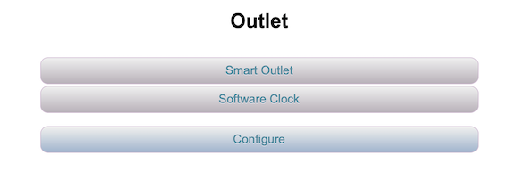
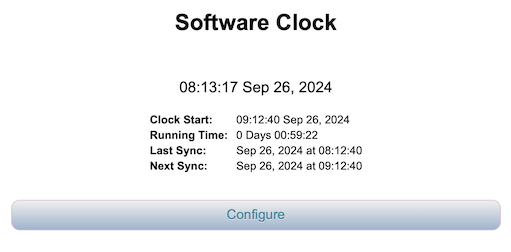

# DeviceLib
DeviceLib is a library of turn-key [UPnPDevices](https://github.com/dltoth/UPnPLib) for ESP8266 and ESP32, based on the [UPnP Device Architecture](http://upnp.org/specs/arch/UPnP-arch-DeviceArchitecture-v1.1.pdf). Use of this library requires the companion libraries [CommonUtil](https://github.com/dltoth/CommonUtil) for user interface, [UPnPLib](https://github.com/dltoth/UPnPLib) for device architecture and service discovery, [SystemClock](https://github.com/dltoth/SystemClock) for NTP synchronized time, and [WiFiPortal](https://github.com/dltoth/WiFiPortal) for access point configuration. 

DeviceLib includes the following classes:

```
   ExtendedDevice         := An extended RootDevice that includes ssdp search to find nearby devices and configuration that includes access point reset
   HubDevice              := An ExtendedDevice that displays all RootDevices on a local network. With HubDevice, only one mDNS name is necessary, all other devices can be 
                             accessed via the HubDevice portal interface
   Sensor                 := A configurable UPnPDevice base class providing Sensor reading as simple HTML and Sensor configuration through ConfigurationServices
   SoftwareClock          := A Sensor that synchronizes system time with an NTP server and provides date and time
   Thermometer            := A DHT22 Temperature/Humidity Sensor. Thermometer requires the additional library DHT_sensor_library_for_ESPx
   Hydrometer             := A Sensor that reads from the analog pin and computes soil moisture content
   Control                := A configurable UPnPDevice base class providing its Control UI thru an iFrame and configuration through ConfigurationServices
   RelayControl           := A Control for managing a relay with two states ON and OFF
   SensorControlledRelay  := A virtual subclass of RelayControl that allows control of a Relay with a Sensor
   HumidityFan            := A SensorControlledRelay that couples a Thermometer with a RelayControl, with ON/OFF determined by relative humidity
   OutletTimer            := A SensorControlledRelay that couples a SoftwareClock with a RelayControl with ON/OFF determined by time intervals
   ControlServices        := UPnPServices for managing ControlState (ON/OFF) and ControlMode (AUTOMATIC/MANUAL)
   ConfigurationServices  := UPnPServices for managing configuration (GetConfiguration/SetConfiguration)
```

The library is centered around the two base classes [Sensor](https://github.com/dltoth/DeviceLib/blob/main/src/SensorDevice.h), a configurable UPnPDevice with simple HTML display, and [Control](https://github.com/dltoth/DeviceLib/blob/main/src/Control.h), a configurable UPnPDevice with complex HTML display. It also includes a turn-key Device Hub, [HubDevice](https://github.com/dltoth/DeviceLib/blob/main/src/HubDevice.h), that can be included in a boilerplate sketch to provide access to all UPnPRootDevices on a local network.

For a detailed review of UPnPDevice development, see [documentation for UPnPLib](https://github.com/dltoth/UPnPLib).

## Basic Usage

To see how this works, consider a [simple sketch](https://github.com/dltoth/DeviceLib/blob/main/examples/RelayControl/RelayControl.ino) consisting of an [ExtendedDevice](https://github.com/dltoth/DeviceLib/blob/main/src/ExtendedDevice.h) with a Control ([RelayControl](https://github.com/dltoth/DeviceLib/blob/main/src/RelayControl.h)), and Sensor ([SoftwareClock](https://github.com/dltoth/DeviceLib/blob/main/src/SoftwareClock.h)). First notice devices are instantiated in global scope above the <i>setup()</i> routine as follows:

```
SSDP             ssdp;
ExtendedDevice   root;
SoftwareClock    c;
RelayControl     relay;
const char*      deviceName = "Outlet";
```

<i>SSDP</i> is used for Service discovery, <i>ExtendedDevice</i> is used as the <i>RootDevice</i> container which includes configuration and device search, <i>SoftwareClock</i> and <i>RelayControl</i> are embedded devices, and the <i>RootDevice</i> display name will be "Outlet". 

Next review device configuration:

```
/**
 *  Set timezone to Eastern Daylight Time
 */
  c.setTimezone(-5.0);

/**
 *  Set client display name to something recognizable from "Nearby Devices".
 */
  root.setDisplayName(deviceName);
  relay.setDisplayName("Smart Outlet");

/**
 *  root.setup() will register HTTP handlers based on target, so setTarget() must always be called prior to setup(), 
 *  otherwise a default target will be used.
 */
  root.setTarget("device");
  relay.setTarget("relay");
```

Timezone on the SoftwareClock is set to EST (-5.0), display name for ``root`` is set to "Outlet" and ``relay`` is set to "Smart Outlet", and targets are set to <b><i>device</i></b> and <b><i>relay</i></b> respectively. Device targets define the HTTP URL for display as shown below.

Also note the last line of code in the <i>setup()</i> function ``UPnPDevice::printInfo(&root);`` will print the UPnPDevice hierarchy to the Serial monitor.

Lastly, see the ``loop()`` function:

```

/**
 *  Do a unit of work for the device
 */
  root.doDevice();

/**
 *  Handle SSDP queries
 */
  ssdp.doSSDP();

/**
 *  Handle HTTP requests
 */
  ctx.handleClient();

```

The ``RootDevice::doDevice()`` method handles any workload indented for the <i>RootDevice</i> or any of its embedded devices, the ``SSDP::doSSDP()`` method handles all request/response for SSDP queries, ``WebContext::handleClient()`` is proxy for the WebServer <i>handleClient()</i> method.

Now, flash an ESP device with the sketch above, start it up and point a browser to the device IP address. 

*Figure 1 - RelayControl display at http://device-IP:80*


Notice that device display is in the order that devices were added to the RootDevice:

```
  root.addDevices(&relay,&c);
```

where <i>RelayControl</i> is at the top of the page just below the <i>RootDevice</i> display name "Outlet", and <i>SoftwareClock</i> is below that just above the <b><i>This Device</i></b> button. <i>RelayControl</i> is displayed in an iFrame whose title is the device display name "Smart Outlet", and consists of a toggle and text.

Selecting the <b><i>This Device</b></i> button displays all of the <i>RootDevice</i> embedded devices as selectable buttons in the order they were added, the same as the page displayed at <i>http://device-IP:80/device</i>.

*Figure 2 - RelayControl display at http://device-IP:80/device*



So a <i>RootDevice</i> displays its embedded devices at <i>http://device-IP:80/root-target</i>, as a list of buttons, one for each embedded device in the order they were added, along with a <i>Configure</i> button. In this example there are buttons for ``RelayControl`` and ``SoftwareClock``, each labeled with their display name. Selecting either will bring up the display for the specific device, and selecting <i>Configure</i> will bring up the <i>RootDevice</i> configuration page. Embedded devices are displayed at <i>http://device-IP:80/root-target/device-target</i>.

Now, select the <b><i>Software Clock</i></b> button.

*Figure 3 - RelayControl display at http://device-IP:80/device/clock*



<b><i>Important Note:</i></b> The default target for <i>SoftwareClock</i> is <b><i>clock</b></i> (defined in its constructor), so if multiple SoftwareClocks are required in a device, each MUST be given a unique target using: 

```
  SoftwareClock::setTarget(const char*)
```

Also, note the difference between <i>SoftwareClock</i> display at <i>http://device-IP:80</i>, where display consists of a single line of HTML, and <i>SoftwareClock</i> display at <i>http://device-IP:80/device/clock</i> where display consists of multiple lines of HTML. That difference is driven by implementation of the ``formatContent(...)`` and ``formatRootContent(...)`` methods as discussed in the custom Sensor example below.

Lastly, notice the Serial monitor output:

```
RootDevice Outlet:
   UUID: b7d7a4db-5c83-4b5c-b89f-7fc56fdeb9b5
   Type: urn:LeelanauSoftware-com:device:ExtendedDevice:1.0.0
   Location is http://192.168.1.30:80/device
   Outlet Services:
      Get Configuration:
         Type: urn:LeelanauSoftware-com:service:getConfiguration:1.0.0
         Location is http://192.168.1.30:80/device/getConfiguration
      Set Configuration:
         Type: urn:LeelanauSoftware-com:service:setConfiguration:1.0.0
         Location is http://192.168.1.30:80/device/setConfiguration
Outlet Devices:
Smart Outlet:
   UUID: 22b6aabb-17a3-45c7-9b2d-6140676bf1a9
   Type: urn:LeelanauSoftware-com:device:RelayControl:1.0.0
   Location is http://192.168.1.30:80/device/relay
   Smart Outlet Services:
      Get Configuration:
         Type: urn:LeelanauSoftware-com:service:getConfiguration:1.0.0
         Location is http://192.168.1.30:80/device/relay/getConfiguration
      Set Configuration:
         Type: urn:LeelanauSoftware-com:service:setConfiguration:1.0.0
         Location is http://192.168.1.30:80/device/relay/setConfiguration
      Set State:
         Type: urn:LeelanauSoftware-com:service:setState:1.0.0
         Location is http://192.168.1.30:80/device/relay/setState
Software Clock:
   UUID: adc739a7-75b6-419a-98fe-466c3e6b14a9
   Type: urn:LeelanauSoftware-com:device:SoftwareClock:2.1.1
   Location is http://192.168.1.30:80/device/clock
   Software Clock Services:
      Get Configuration:
         Type: urn:LeelanauSoftware-com:service:getConfiguration:1.0.0
         Location is http://192.168.1.30:80/device/clock/getConfiguration
      Set Configuration:
         Type: urn:LeelanauSoftware-com:service:setConfiguration:1.0.0
         Location is http://192.168.1.30:80/device/clock/setConfiguration
      Get Date/Time:
         Type: urn:LeelanauSoftware-com:service:getDateTime:1.0.0
         Location is http://192.168.1.30:80/device/clock/getDateTime
```

First notice that the loacation of the <i>RootDevice</i> and embedded devices are as discussed above. Also note that <i>ExtendedDevice</i> has standard <i>GetConfiguration</i> and <i>SetConfiguration</i> <i>UPnPServices</i>, as do <i>Sensor</i> and <i>Control</i>, and that <i>RelayControl</i> has a <i>SetState</i> service and <i>SoftwareClock</i> has a <i>GetDateTime</i> service. Configuration and <i>UPnPServices</i> are discussed further below.


## Creating a Custom Sensor

A <i>Sensor</i> is a simple device that provides a reading, like temperature or moisture content, and supplies its display in minimal HTML, ideally a single line. A custom <i>Sensor</i> will derive from the [Sensor](https://github.com/dltoth/DeviceLib/blob/main/src/SensorDevice.h) class.  As an example, consider a custom clock that provides current time as the sensor reading. See the class definition for [CustomClock](https://github.com/dltoth/DeviceLib/blob/main/examples/RelayControl/CustomClock.h) and note the following:

```
   class CustomClock : public Sensor {
       public:
       CustomClock() : Sensor("customClock") {setDisplayName("Custom Clock");}
       CustomClock( const char* target ) : Sensor(target) {setDisplayName("Custom Clock");}
       virtual ~CustomClock() {}
```

The <i>CustomClock</i> class derives from <i>Sensor</i> and uses a [SystemClock](https://github.com/dltoth/SystemClock/blob/main/src/SystemClock.h) as a timepiece

```
    protected:

      SystemClock     _sysClock;  

```

It requires definition of the following virtual functions:

```
    void   setup(WebContext* svr)                   { Sensor::setup(svr);_sysClock.updateSysTime();}
    void   doDevice()                               {_sysClock.doDevice();}
```

The <i>setup()</i> function calls <i>setup()</i> on the base class and starts the <i>SystemClock</i>, and <i>doDevice()</i> does a unit of work for the clock.

Sensor display is governed by implementation of the virtual methods:

```
    int formatContent(char buffer[], int size, int pos);       // Format content as displayed at the device target, return updated write position
    int formatRootContent(char buffer[], int size, int pos);   // Format content as displayed at the root device target, return updated write position

```

In <i>RootDevice</i> display, ``formatRootContent(...)`` is called to provide HTML for an iFrame for <i>Control</i>, or a single line of HTML for a <i>Sensor</i> reading. In <i>UPnPDevice</i> display, the method `formatContent(...)` is called to provide HTML for the device display.


## Creating a Custom Control

## Creating a UPnPService

## Adding Configuration


